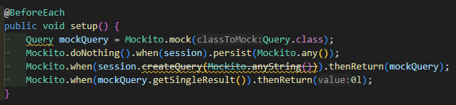

# describe-gh-image-demo

This project shows how simple it is for a Quarkus application to use the GPT-4o model in order to extract code from a screenshot reported by a user.

Here is the real world screenshot uploaded to a GitHub issue 



## Prerequisites

Have an OpenAI key

## Run

```bash
# start Quarkus
QUARKUS_LANGCHAIN4J_OPENAI_API_KEY=your-key mvn quarkus:dev
# hit the endpoint
curl http://localhost:8080/image/describe
```

The result should be:

```java
@BeforeEach
public void setup() {
    Query mockQuery = Mockito.mock(Query.class);
    Mockito.doNothing().when(session).persist(Mockito.any());
    Mockito.when(session.createQuery(Mockito.anyString())).thenReturn(mockQuery);
    Mockito.when(mockQuery.getSingleResult()).thenReturn(0l);
}
```
